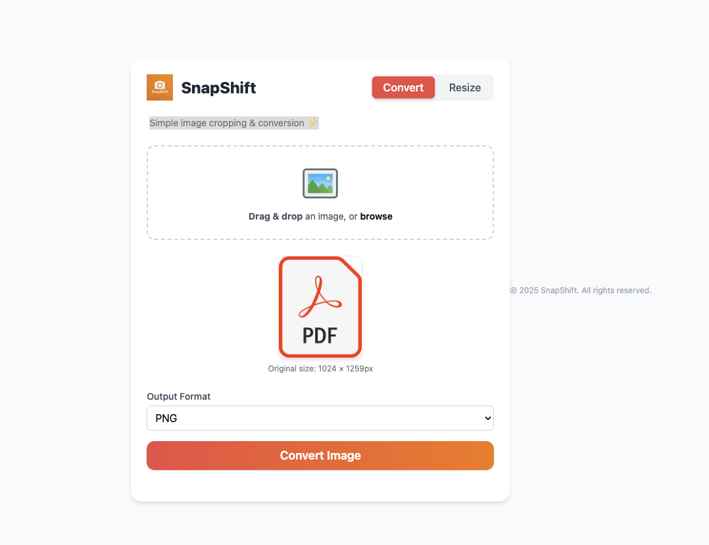

# 📸 SnapShift

SnapShift is a modern, clean, and fast image tool that allows you to:
- ✅ Convert images between PNG, JPEG, and PDF formats
- 📐 Resize images while optionally locking the aspect ratio
- 🔁 Drag-and-drop or browse files with real-time preview
- 🌙 Toggle dark mode for a better viewing experience

---

## 🚀 Features

- 🖼 Live image preview before conversion or resizing
- 🧠 Aspect ratio locking (optional) for smart resizing
- ⚡ Real-time UI updates with smooth transitions
- 🌓 Dark mode toggle support
- 🖱 Drag-and-drop image upload zone
- 🎯 Clean mobile-responsive design
- ✅ Loading spinner and success messages after processing

---

## 💻 Tech Stack

| Frontend | Backend  | Libraries  |
|:--------|:---------|:-----------|
| HTML, TailwindCSS, JavaScript | Flask (Python 3.x) | Pillow (PIL), Gunicorn |

---

## 📁 Project Structure

snapshift/
├── app.py                 # Flask backend app
├── templates/
│   └── index.html         # Frontend interface (HTML)
├── static/
│   ├── script.js          # Main frontend JS logic
│   └── logo.png           # App logo
├── requirements.txt       # Project dependencies
└── README.md              # Project documentation

## 🛠 Setup & Run Locally

```bash
# Clone the repository
git clone https://github.com/your-username/snapshift.git
cd snapshift

# (Optional) Create a virtual environment
python3 -m venv venv
source venv/bin/activate

# Install dependencies
pip install -r requirements.txt

# Run the Flask app
python app.py
```

Then visit: [http://localhost:5050](http://localhost:5050)

---

## 🧪 How to use Snapshift

1. Drag and drop or upload an image file (PNG, JPEG, etc.)  
2. Choose to Convert the format or Resize the dimensions  
3. Click the Convert or Resize button  
4. Wait for the spinner to finish processing  
5. Download the processed file automatically!

---

## 🌐 Live Demo

> ✅ Hosted Live: [SnapShift on Railway](https://snapshift-production.up.railway.app/)

---

## 📸 Credits
- ChatGpt
- Icons by [Icons8](https://icons8.com)
- Favicon generated using SnapShift’s custom design

---

## 🖼 Screenshot

Here’s what SnapShift looks like in action:



---

## 📄 License

This project is licensed under the MIT License - see the [LICENSE](LICENSE) file for details.

> Built with 💻 by Ruben

---

## 🚀 Deployment Notes

SnapShift is a Python Flask web application and is deployed on Render.com.  
It cannot be hosted directly through GitHub Pages because it requires a backend server.  
The code is available publicly on GitHub for review, but the live app runs on Render.

---
